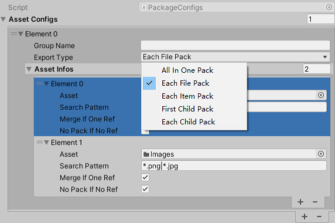
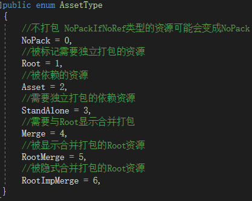
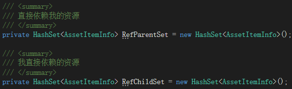
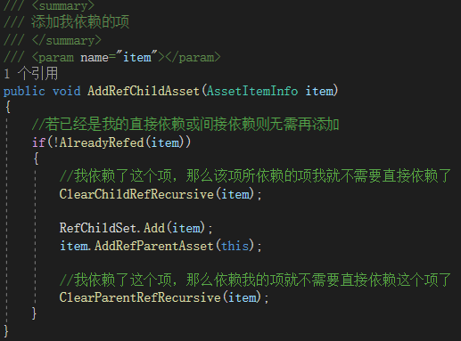
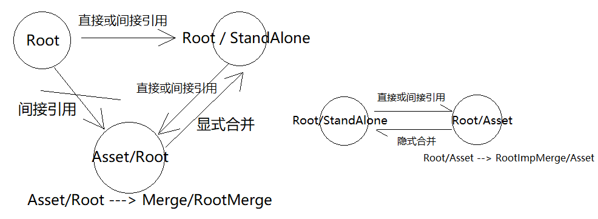
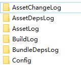

# 一个可自动分析依赖关系的无冗余打包工具
### 打包策略配置

**Group：** 资源配置按照Group -> Item 划分，一个Group可以包含多个Item。

**ExportType：** 每个Group可以选择不同的ExportType，

1.以Group为单位全部打到一个以GroupNaem命名的包里。
2.每个文件单独打一个AB。
3.以Item为单位每个Item打一个AB，包名取Item的目录或资源名。
4.以Item为单位，每个Item的第一级目录或资源文件打一个AB。
5.以Item为单位，每个Item的每一级目录或资源文件打一个AB。

**GroupName：** 当ExportType选为AllInOnePack时的包名，若不填，则取第一个Item的目录或资源名。

**Item：**每个Item可以是文件夹或具体资源文件。

**SearchPattern：** 若Item是文件夹，则可以按照文件后缀检索资源文件。

**MergeIfOneRef：** 配置若资源只有一个引用，则与被引用的资源合并打到一个AB里。

**NoPackIfNoRef：** 配置若资源没有被任何其它资源引用，则不参与打包。

### 依赖分析
依据ExportType配置以及依赖关系，将所有需要打包的资源分为这6种类型。

**Root资源：** 按照ExportType配置首次Load进来的资源全都默认设置为Root类型。
#### 收集依赖资源，并构建依赖关系
##### 收集依赖资源
使用Unity  EditorUtility.CollectDependencies接口收集所有依赖资源，剔除系统内置资源和Root类型的资源，全部标记为Asset类型。
##### 构建依赖关系

为每个资源创建两个集合，一个依赖集合，一个被依赖集合。

资源的之间的依赖关系分为直接依赖关系和间接依赖关系，
如A依赖B，B依赖C，则A与B，B与C之间为直接依赖，A与C之间为间接依赖。资源之间的依赖关系应该保持单调，由于CollectDependencies接口会获取到A资源的所有依赖，也就是这里的B和C都会被获取到，则在构建依赖关系时，只需添加B为A的直接依赖资源，而A对C的依赖则可以通过B获取到。在添加依赖的过程中原本的直接依赖又可能转变为间接依赖资源，如后续又添加了D为A的直接依赖资源，同时D又依赖B，那么此刻B就变成了间接依赖资源，应当移除A对B的直接依赖。

#### 依赖数量分析和资源类型划分
**Unity的打包机制**

由于Unity构建AB的时候会自动分析资源之间的依赖关系，没有设置Bundle名的资源将被合并到被依赖的AB中打包，而设置过Bundle名的资源，将会和被依赖的资源构成依赖关系，Unity在打被依赖的资源的时候就不会包含该资源。如A依赖B，若B没有设置Bundle，则将会被合并到A的包里，若设置了Bundle则A的包里就不会包含B，避免打包的时候资源冗余。

**显式合并打包**

而打包的时候可能会出现这种现象，A B C三个资源，A B 都设置了Bundle独立打包，C被A和B共同引用，但是A同时还引用了B，也就是C其实是A的间接引用，是B的直接引用，那么C其实只需要与B合并打包即可，只需将C的Bundle设置为与B相同，而不用为C单独设置Bundle，我称这种现象为 **显式合并打包** 。

而若C只被B直接引用，且没有被其他任何资源直接或间接引用，则无需为C设置任何Bundle名，Unity将会自动将C合并到B的包里，我称这种现象为 **隐式合并打包** 。

依据构建出来的依赖关系，统计资源被Root类型依赖的次数。

**对于Root类型的资源，即通过打包配置首次Load进来的资源：**

若Root类型的资源设置了NoPackIfNoRef，则将被依赖次数为0的Root资源修改为NoPack类型，不参与打包。
若Root类型的资源设置了MergeIfOneRef，则将被Root依赖次数为1，并且没有被其它Root资源间接依赖的Root资源类型修改该为RootImpMerge，表示隐式合并打包，不需要设置Bundle名，而如果还有被其它Root资源间接依赖，则将资源类型修改为RootMerge，表示显式合并打包，需要设置与被直接依赖的Root相同的包名。
没有设置NoPackIfNoRef和MergeIfOneRef 或 被Root依赖次数大于1则保持Root类型，独立打包。

**对于Asset类型的资源，即通过引用关系收集到的资源：**

若被Root依赖次数大于1，则将该Asset资源类型修改为StandAlone，表示被多个Root资源引用，需要独立打包，
若被Root依赖次数为1，并且没有被其它Root类型间接依赖，则隐式打包，由于Asset类型本身就是隐式打包的，所以无需修改，而如果还有被其它Root资源间接依赖，则将Asset类型修改为Merge类型，表示显示合并打包，并设置与第一个被依赖的Root相同的包名。

### 打包
依照划分出来的资源类型，将NoPack类型不打包，Asset与RootImpMerge不设置Bundle名隐式打包，其余类型按照所设置的Bundle名分别打包。

### 增量打包
#### 记录所有资源文件和Meta文件的md5值
Unity在构建AssetBundle的时候会自动分析，当构建目录中已存在相同的AB包，则本次构建不会重新制作这些相同的AB包，只制作有变化或新增的AB包，也就是说Unity本身的增量打包机制是基于构建目录中已存在的所有AB包。
这样就会造成我的每一次增量打包都需要依赖于之前打包生成的这些AB文件，由于一般项目中的AB文件往往数量众多，占据的内存也很大，依赖历史版本生成的AB文件存在一定风险，并且当某个版本的AB包需要重做的时候还得把构建目录中的AB包还原回对应版本，否则原本无需重打的AB包也被重打了，降低打包效率，维护起来也不方便。于是我想干脆就不依赖Unity本身增量打包的机制了，直接自己比对资源文件差异，只将有变动或新增的资源重新制作AB，这样只需要维护一张资源列表的md5即可。
由于Unity的一些资源信息会被记录在meta文件中，如图片，mesh等，所以还要额外记录meta的md5。

#### 移除Manifest文件并构建AB包之间的依赖关系
**构建AB包的依赖**

原本构建全量AB包的时候Unity会为我们生成一个Manifest文件，里面记录了AB之间的依赖关系，用于在加载AB的时候加载对应的依赖AB，但是现在由于我们只对变动或新增的资源文件构建AB，那么Unity生成出来的Manifest文件中也只会包含这一部分AB之间的依赖关系，无法用于加载依赖AB。所以这里只能我们自己来构建一个AB之间的依赖关系了，依照与上面构建资源依赖关系类似的方法，每次打包的时候都重新构建AB之间的依赖关系，用于加载AB时候的依赖关系获取，并且这里只需记录AB直接直接依赖的关系，间接依赖的关系可以通过加载依赖AB的直接依赖加载到，所以无需记录，也能减小一些依赖配置表的大小。

**移除Manifest文件**

自己维护AB之间的依赖关系之后，原本的Manifest文件就没什么用了，而且Unity对每个AB包都会生成一个对应的Manifest文件，算下来也是一笔不小的内存占用，把这些Manifest文件全部删除以后还能减小一些包体。

#### 移除不再需要的AB
依据每次打包时候的所有资源对应的AB包名，可以将构建目录中之前打的AB包，并且本次没有构建的AB包删除。

### 一些Log日志
每次打包都额外生成了一些日志文件，用于后续可能的问题排查。
生成的日志文件会存放在工程根目录的同级目录AssetBuildInfo中，打包的时候会自动创建与工程目录同名的文件夹，并按照打包平台创建对应的文件夹输出日志文件。

AssetChangeLog：每次打包有变动或新增的资源文件
AssetDepsLog：每次打包所有资源的引用关系
AssetInfoLog：每次打包所有资源被划分的资源类型和包名
BuildLog：打包过程中的一些日志和错误信息。
BundleDepsLog：每次打包生成的AB之间的依赖关系
Config：
每次打包所有资源的类型，Md5，metaMd5和包名等信息，用于增量打包时的差异对照用。
额外还有一个记录当前版本好的一个配置文件。

###### 本文主要参考借鉴了GitHub上阿唐的[ABSystem](https://github.com/tangzx/ABSystem)项目的一些思路。